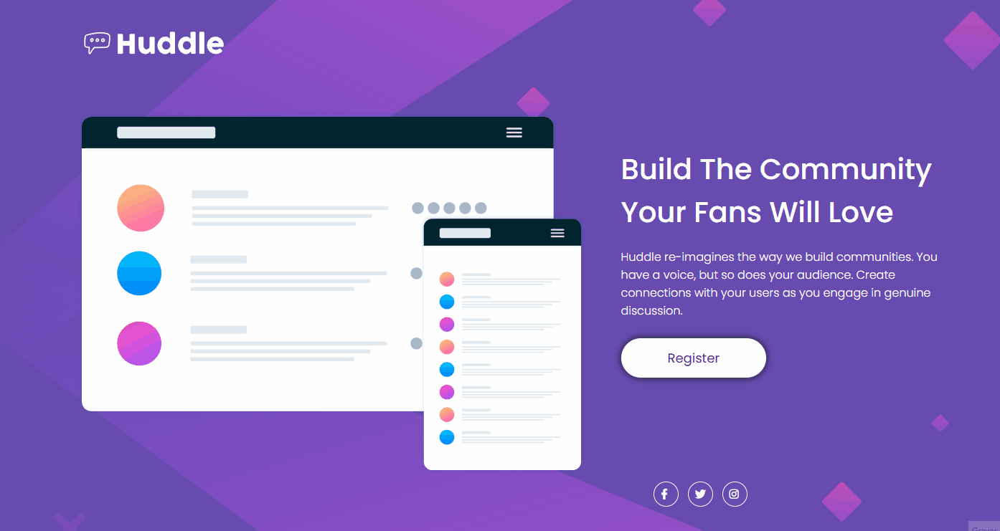
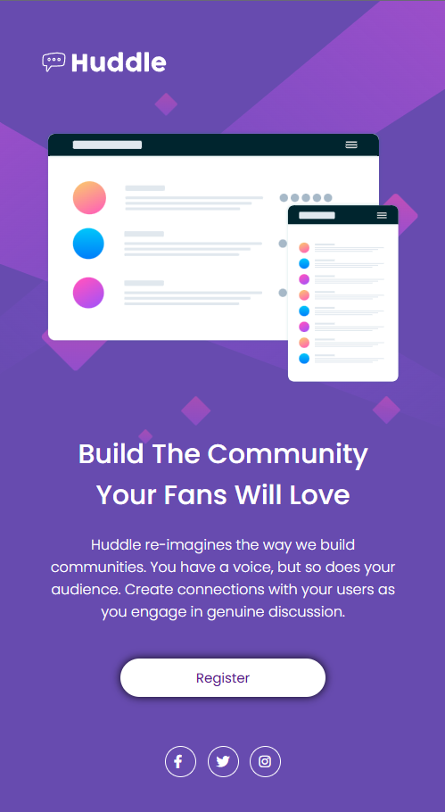

# Huddle Landing Page | Frontend Mentor
Desafio de HTML e CSS avançado do curso DevQuest 🚀

## Visão Geral

Este é um desafio do Frontend Mentor compatível com desktop e mobile.

  
  

## Tecnologias utilizadas:
- HTML
- CSS

## Desafios
> Foi um grande desafio fazer esse projeto sozinho, mas consultando minhas anotações e percebendo o desenvolvimento, a cada passo dado me sentia ainda mais empolgado e feliz com o resultado.

## Autor

[Valdeano Barbosa - Linkedin](https://www.linkedin.com/in/valdeanofilho/)
